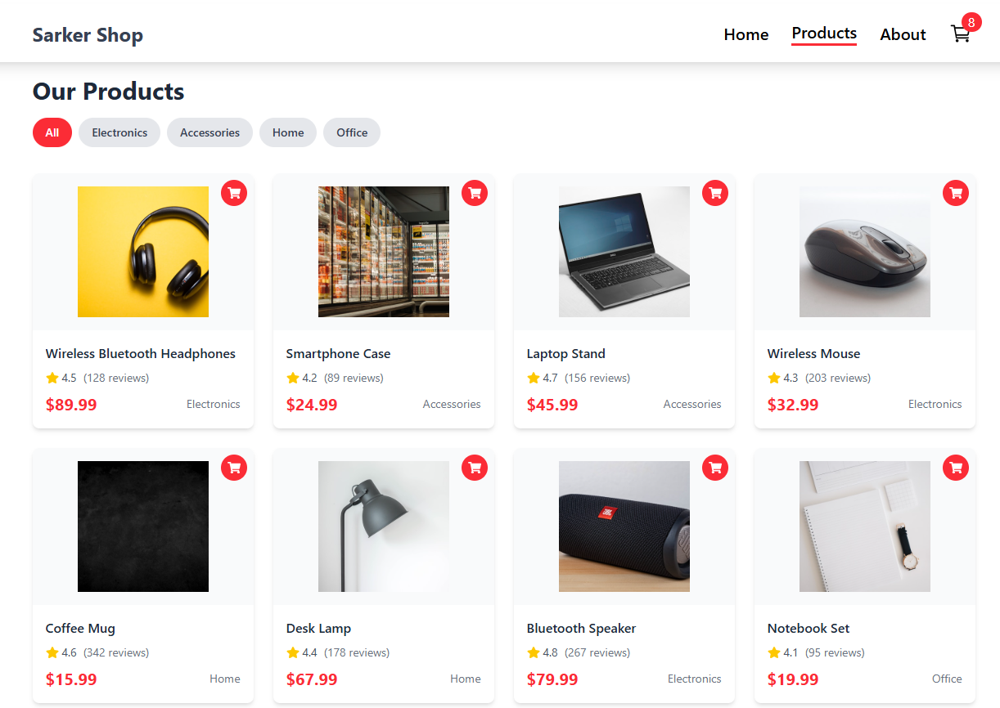

# Sarker Shop 2026




## Getting Started

Follow these steps to run this project locally:

### Prerequisites

- [Node.js](https://nodejs.org/) (v16 or higher recommended)
- [npm](https://www.npmjs.com/) (comes with Node.js)

### Installation

1. Clone the repository:
   ```bash
   git clone https://github.com/samircd4/sarker_shop_2026.git
   cd sarker_shop_2026
   ```
2. Install dependencies:
   ```bash
   npm install
   ```

### Running the Project

Start the development server:

```bash
npm run dev
```

Open your browser and go to the URL shown in the terminal (usually http://localhost:5173).

---

Feel free to contact us if you want to contribute.
